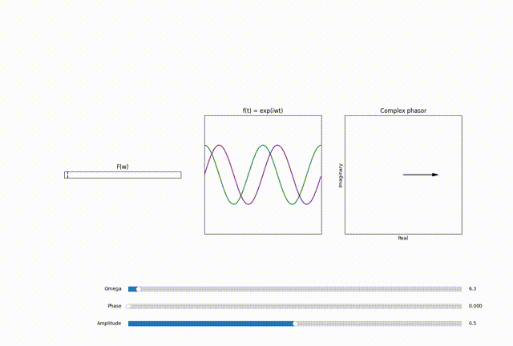

## Inside DFT
The output of the DFT is a collection of complex numbers, each representing a unique sinusoid in the original signal. These complex numbers, or phasors, hold the key to both the amplitude and phase of these complex sinusoids, essentially encoding how each sinusoid is scaled and shifted. 

## Complex Phasors

A phasor $F(\omega = \omega_0)$ in the DFT output is more than just a number; it's a vector in the complex plane.And in fourier transform plot we mostly show the magnitude of this phasor. 

The magnitude indicates the contribution of each sinusoid to the overall signal.

Thus a phasor $F(\omega_0)$:
$$F(\omega = \omega_0) = x + iy$$
with amplitude $A$:
$$A =  \sqrt{x^2 + y^2}$$
and phase  $\phi$:
$$\phi = \tan^{-1}(\frac{y}{x})$$

scales the base complex sinosoid $e^{- i \omega_0 t}$ by a factor of $A$ and shifts it by a phase of $\phi$
$$A e^{- i \omega_0 t + \phi }$$

Each of these sinusoids is a fundamental building block of the orignal signal, characterized by a specific frequency. The DFT decomposes the signal into these basic elements, revealing how each frequency contributes to the overall structure of the signal

## Sum of Sinusoids

Ultimately, any  signal $f(t)$ can be represented by a specific set of scaled and shifted sinusoids. And Summing over these sinosoids, governed by the principles encoded in the phasors, gives us back the original signal in its time-domain form. This is the essence of the DFT: decomposing a signal into its sinusoidal components and then reconstructing it from these components.

## Exploring the DFT with coded Animation

Through animation, we can dynamically illustrate the transformative process of the DFT. The goal is to visually demonstrate how:

Each point in the $F(\omega)$ plot corresponds to a certain frequency and an associated phasor.
These phasors define the amplitude and phase of sinusoids at these specific frequencies.
By summing these scaled and shifted sinusoids, we can reconstruct the original signal.

<!-- put mp4 video that loops here  -->

 <!-- <figcaption>Fig 4: Python simulation for the phenomenon in Fig. 2  </figcaption> -->

<!-- add referene section -->

## References
1. [The Fourier Theory in MRI ](https://youtu.be/R_4GuyJTzMo?t=350)
